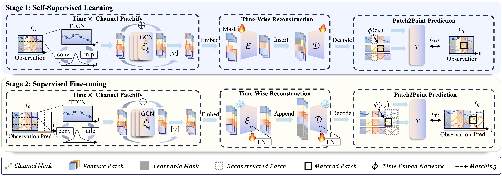

# IMTS is Worth Time × Channel Patches: Visual Masked Autoencoders for Irregular Multivariate Time Series Prediction

The official implementation of **ICML 25** paper *IMTS is Worth Time × Channel Patches: Visual Masked Autoencoders for Irregular Multivariate Time Series Prediction*. [[pdf](https://github.com/WHU-HZY/VIMTS/paper/VIMTS_ICML2025.pdf)] [[poster](https://icml.cc/virtual/2025/poster/46570)]


## TL;DR

The core idea is to adapt the powerful capabilities of pre-trained visual MAEs to IMTS data via self-supervised latent space mask reconstruction for enhanced performance and few-shot capability.


## Methodology
<p align="center">
  
</p>

The overall architecture of **VIMTS**.  The irregularly sampled data in each channel is divided into sections with equal-intervals along the timeline.  Each section undergoes intra-section feature extraction using Time-aware Convolutional Network (TTCN) and cross-channel information compensation via Graph Convolutional Networks (GCNs).  These compensated patches are then fed into a pre-trained MAE for patch reconstruction, thereby modeling temporal dependencies among patches within each channel.  Finally, a coarse-to-fine technique gradually generates precise predictions from patch-level to point-level.  The training encompasses two stages.  First, self-supervised learning aims to improve IMTS modeling by adapting the capabilities of the visual pre-trained MAE to IMTS data.  Second, the supervised fine-tuning is employed to enhance forecasting performance.


## Requirements


```shell
conda create -n vimts python=3.9.20

conda activate vimts

bash install.sh
```


## Datasets Preparation
For *Physionet*, *Human Activity*, and *USHCN*, we utilize totally the same preprocessing pipeline as the same as [t-PatchGNN](https://github.com/usail-hkust/t-PatchGNN). And here we provide the processed data files in `/IMTS/data/`.


Until the acceptance of this paper, for *MIMIC*, because of the [PhysioNet Credentialed Health Data License](https://physionet.org/content/mimiciii/view-dua/1.4/) and the [issues](https://github.com/usail-hkust/t-PatchGNN/issues/16) in preprocessing scripts of [t-PatchGNN](https://github.com/usail-hkust/t-PatchGNN) , we have to apply for a permission for raw data through [this link](https://physionet.org/content/mimiciii/1.4/). And then sequentially execute the **corrected** notebooks *admissions.ipynb*, *output.ipynb*, *labevents.ipynb* and *prescriptions.ipynb* *and mimic_prep.ipynb* to get *full_dataset.csv*, then the python scripts can automatically process it.


## Run the Model

First, `cd` to the `IMTS` directory and run the following command:

```shell
cd path/to/this/repo/IMTS
```

Second, run the scripts to conduct experiments on `ushcn`/`physionet`/`activity`/`mimic` dataset.

* Self-Supervised Learning Stage:
  ```shell
  bash scripts/{$dataset}/pretrain.sh
  ```

* Fine-Tune Stage based on `logs/physionet/pretrain/pretrain_weights/xxxx.pth` (manually fill in finetune.sh):
  ```shell
  bash scripts/{$dataset}/finetune.sh
  ```

## Parameter Explanation
```python
python run_models.py 
    --model VisionTS-B \      # The model size we choose as backbone
    --dataset ushcn \         # The dataset name
    --state 'def' \
    --history 24 \            # The length of history data
    --patience $patience \    # The patience of earlystopping
    --batch_size 64 \         # The batch size of training and inference
    --lr 1e-4 \               # The learning rate
    --patch_size 1 \          # The temporal window size for each patch
    --stride 1 \              # The temporal stride size for each sliding operation
    --nhead 1 \
    --tf_layer 1 \ 
    --nlayer 3 \              # The number of GCN layers
    --te_dim 10 \             # The dimension of time embddings
    --node_dim 10 \           # The dimension of GCN vertex embeddings
    --hid_dim 32 \            # The length of hidden features before MAE
    --train_mode fine-tune \  # [pre-train, fine-tune]
    --finetune_type norm \    # Finetune types selected from [norm, wo_ssl_ft, attn, mlp, freeze, all] 
    --mask_ratio 0.4 \        # Mask ratio for mask-reconstruction self-supervised learning
    --few_shot_ratio None \   # fewshot ratio from [None, 0.5, 0.2, 0.1], None means training with full data
    --seed 1 \                # seed for models
    --gpu 1 \                 # gpu index for use
    --log_dir finetune \      # log dir name defined by yourself
```
## Logs of Main Experiments 

`/data/hzy/lvm4-ts/IMTS/logs/`


## Citation

```
@inproceedings{zhangvimts2025,
  title={IMTS is Worth Time $\times$ Channel Patches: Visual Masked Autoencoders for Irregular Multivariate Time Series Prediction},
  author={Zhangyi, Hu and Jiemin, Wu and Hua, Xu and Mingqian, Liao and Ninghui, Feng and Bo, Gao and Songning, Lai and Yutao, Yue },
  booktitle={ICML},
  year={2025}
}
```

## Acknowledgement
Some components of this code implementation are adopted from [VisionTS](https://github.com/Keytoyze/VisionTS) and [t-PatchGNN](https://github.com/usail-hkust/t-PatchGNN). We sincerely appreciate for their contributions.
